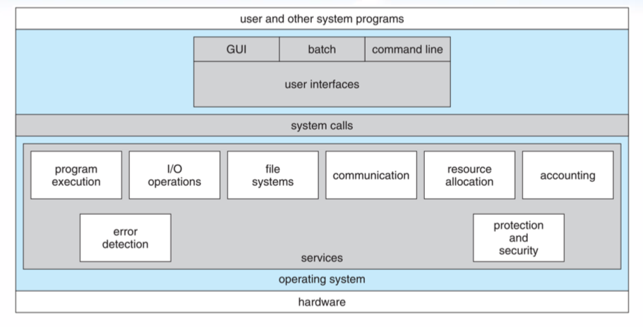
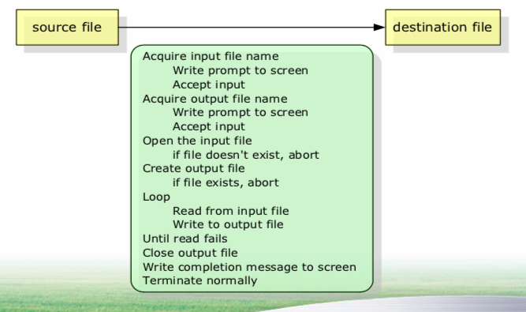

# 운영체제 구조

* **살펴봐야 할 세가지 관점**
  * 운영체제의 서비스
  * 운영체제의 인터페이스
  * 시스템들의 상호 연결

# Operating System Services(운영체제 서비스)

## 프로그래머의 편리성 제공(1)

* **OS는 프로그램 실행 환경을 제공**
  * 프로그램과 사용자들에 대한 정해진 서비스 제공
  * 프로그래머에 대해 편리함을 제공
  * (OS는 초반에 프로그래머를 위해 만들어진 것 이였다.)
* **OS Services**
  * 사용자 인터페이스(User Interface, UI)
  * 프로그램 실행(Program execution)
  * 입출력 연산(I/O operation)
  * 파일 시스템 조작(File system manipulation)
  * 통신(communication)
    * 프로세스 간에 정보 교환
  * 오류 탐지(error detection)

## 시스템 자체의 효율적인 동작 보장

 OS는 **시스템 자체의 효율적인 동작을 보장** 하기 위한 기능들을 제공한다.

* **자원 할당(resource allocation)** : ex) 스케줄러
* **회계(accounting)** : 컴퓨터 자원을 얼마나 사용하는지 기록
* **보호(protection)와 보안(security)** : 시스템 자원을 함부로 접근할 수 없도록 한다.

# User Operating System Interface         (사용자 운영체제 인터페이스)

## 명령어 해석기

* 어떤 운영체제는 커널에 **명령어 해석기** 를 포함하고 있다.
  * Ex) 셸(shell), bash
  * 명령어 ex) ls, rm, mkdir, …
* **명령어 구현의 두 가지 방식**
  * 명령어 해석기 자체가 명령을 실행할 코드를 갖고 있는 경우
  * 시스템 프로그램에 의해 대부분의 명령을 구현 (구현해놓은 명령을 찾아서 실행)

## 그래피컬 사용자 인터페이스

 사용자 친화적인 **그래피컬 사용자 인터페이스(GUI)** 를 통한 방식

**ex)** Windows, Mac OS, UNIX, …

# System Calls (시스템 호출)

 시스템 호출은 **운영체제에 의해 사용 가능한 서비스에 대한 인터페이스를 제공한다.**

* **시스템 호출이 사용되는 예**

  파일 => 다른 파일, 데이터를 복사한다.

  

  > 1. 원본 파일 입력(**화면에 출력, 입출력, 시스템 호출**)
  > 2. 출력 파일 입력
  > 3. 원본 파일 오픈
  > 4. 출력 파일 생성
  > 5. 원본 읽기 => 출력 파일 쓰기
  > 6. 파일들을 닫음

