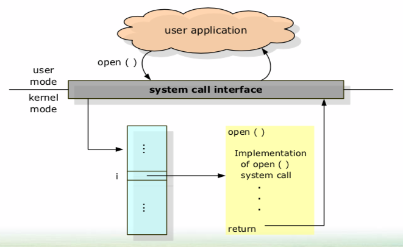
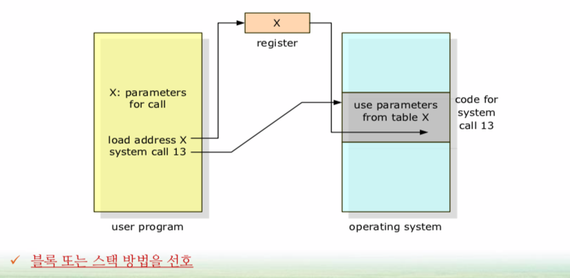
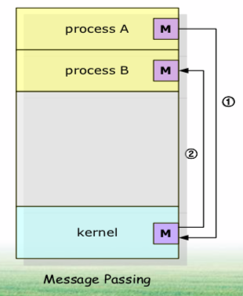
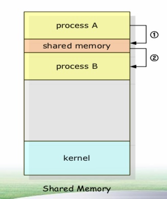
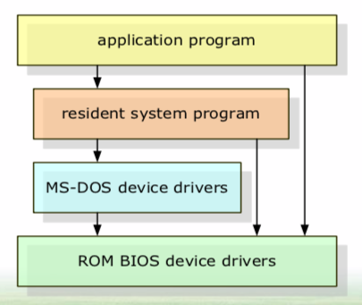
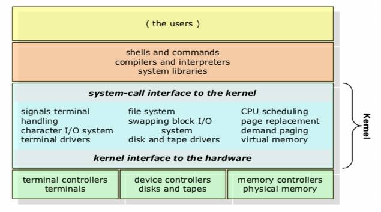
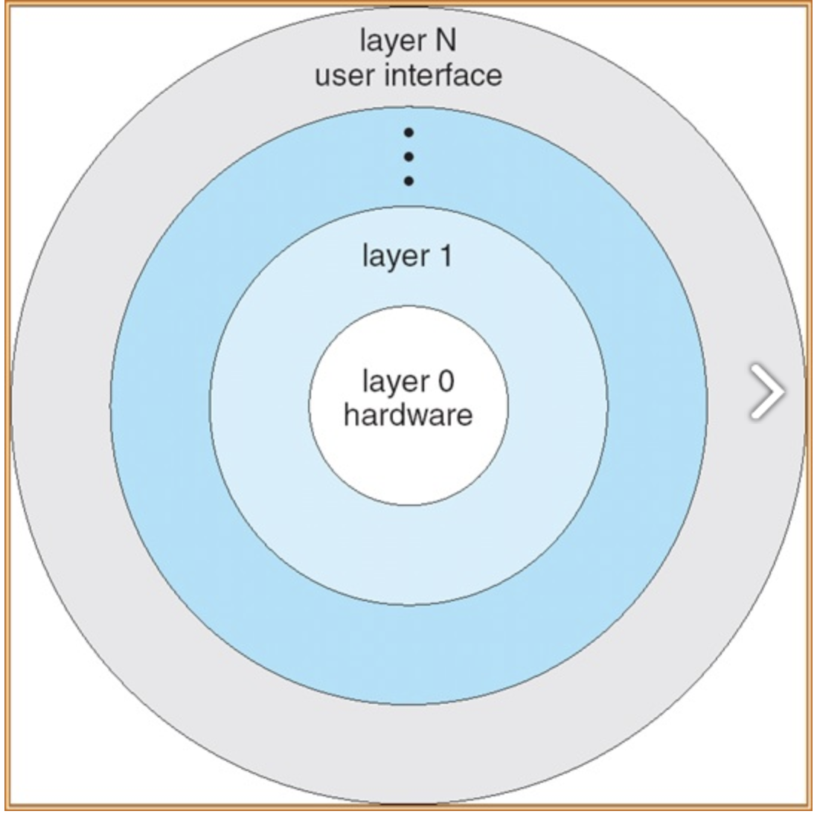
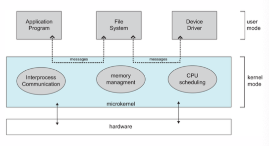
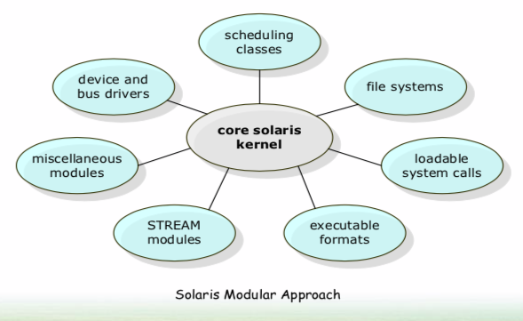

# Operating System Structure                             (운영체제 구조)

* **살펴봐야 할 세가지 관점**
  * 운영체제의 서비스
  * 운영체제의 인터페이스
  * 시스템들의 상호 연결

# 01. Operating System Services.                        (운영체제 서비스)

## 프로그래머의 편리성 제공(1)

* **OS는 프로그램 실행 환경을 제공**
  * 프로그램과 사용자들에 대한 정해진 서비스 제공
  * 프로그래머에 대해 편리함을 제공
  * (OS는 초반에 프로그래머를 위해 만들어진 것 이였다.)
* **OS Services**
  * 사용자 인터페이스(User Interface, UI)
  * 프로그램 실행(Program execution)
  * 입출력 연산(I/O operation)
  * 파일 시스템 조작(File system manipulation)
  * 통신(communication)
    * 프로세스 간에 정보 교환
  * 오류 탐지(error detection)

## 시스템 자체의 효율적인 동작 보장

 OS는 **시스템 자체의 효율적인 동작을 보장** 하기 위한 기능들을 제공한다.

* **자원 할당(resource allocation)** : ex) 스케줄러
* **회계(accounting)** : 컴퓨터 자원을 얼마나 사용하는지 기록
* **보호(protection)와 보안(security)** : 시스템 자원을 함부로 접근할 수 없도록 한다.

# 02. User Operating System Interface.             (사용자 운영체제 인터페이스)

## 명령어 해석기

* 어떤 운영체제는 커널에 **명령어 해석기** 를 포함하고 있다.
  * Ex) 셸(shell), bash
  * 명령어 ex) ls, rm, mkdir, …
* **명령어 구현의 두 가지 방식**
  * 명령어 해석기 자체가 명령을 실행할 코드를 갖고 있는 경우
  * 시스템 프로그램에 의해 대부분의 명령을 구현 (구현해놓은 명령을 찾아서 실행)

## 그래피컬 사용자 인터페이스

 사용자 친화적인 **그래피컬 사용자 인터페이스(GUI)** 를 통한 방식

**ex)** Windows, Mac OS, UNIX, …

# 03. System Calls (시스템 호출)

## 시스템 호출의 사용

 시스템 호출은 **운영체제에 의해 사용 가능한 서비스에 대한 인터페이스를 제공한다.**

* **시스템 호출이 사용되는 예**

  파일 => 다른 파일, 데이터를 복사한다.

  

  > 1. 원본 파일 입력(**화면에 출력, 입출력, 시스템 호출**)
  > 2. 출력 파일 입력
  > 3. 원본 파일 오픈
  > 4. 출력 파일 생성
  > 5. 원본 읽기 => 출력 파일 쓰기
  > 6. 파일들을 닫음

## 응용 프로그래밍 인터페이스의 사용

 대부분의 개발자들은 **응용 프로그램 인터페이스(API: Application Program Interface)**에 따라 프로그램 설계

* API 에서 **시스템 호출(OS 마다 다르다)**을 호출한다.
* API 는 **OS를 감싸서 만든 것** 이다.

## 시스템 호출 인터페이스

 호출자는 시스템 호출이 어떻게 구현되고 실행 중 무슨 작업을 하는지 알 필요가 없다.

* **user mode** : UI, 유저 인터페이스
* **kernel mode** : OS, 운영체제
  * 시스템 호출 함수가 OS 안에 번호(i)로 매핑되어 있다.

## 운영체제에 매개변수 전달 방법

 시스템 호출 자체 보다 더 많은 정보를 요구한다면? => **매개 변수 전달 요구**

> 예시)
>
> 1. 사용자 프로그램이 **open("A")**, A 파일을 여는 함수를 호출
> 2. "A" 파라미터(파일)을 레지스터에 저장
> 3. OS에서 13번으로 매핑되어 있는 open() 시스템 호출을 호출한다.
> 4. OS는 레지스터에 있는 정보를 갖고 13번 시스템 호출을 한다.

# 04. Types of System Calls (시스템 호출 유형)

 OS 마다 시스템 호출이 다르다.

## 프로세스 제어

* 프로그램 끝내기(end) 또는 중지(abort)
* 적재(load)와 실행(execute)
* 생성(create)과 종료(terminate)
* 속성(process attribute)
* 프로세스 생성 후 이들의 실행이 끝나기를 기다릴 필요가 있다.
  * 시간 기다림(wait time)
* 공유 데이터를 잠글 수 있는 시스템 호출 제공
* 파일 관리를 위한 시스템 호출
  * open, close
* 장치 관리를 위한 시스템 호출
  * 장치의 요청(request)와 방출(release)

## 통신

두 가지 일반적인 통신 모델

* **메시지 전달(message passing) 모델** : 프로세스 간 통신 기능을 통한 정보 교환

  

  > 1. OS 에게 데이터를 메시지로 전달
  > 2. OS 가 process A의 데이터를 메시지로 B에게 전달

  * 소량의 데이터를 교환한다.

* **공유 기억장치(shared memory) 모델** : 두 개 이상의 프로세스들이 기억장치에 접근

  

  > 1. process A가 공유 데이터에 데이터를 저장
  > 2. process B가 공유 데이터에서 데이터를 가져다 쓴다.

  * 영역이 공유된다.
  * 많은 데이터를 공유할 때 사용된다.
  * 속도가 빠르고 편리하나 보호와 동기화가 약하다.

# 05. System Programs (시스템 프로그램)

OS가 제공하는 명령

* **시스템 프로그램은 프로그램 개발과 실행을 위한 보다 편리한 환경 제공**

  : 대부분 사용자가 보는 운영체제는 시스템 호출(system call) 보다는 시스템 프로그램(system program)에 의해 정의된다.

# 06. Operating System Structure (운영체제 구조)

일반적으로 한 개의 일관된 시스템 보다는 **태스크(할 일)를 작은 구성 요소로 분할한다.**

## 간단한 구조(1)

* **MS-DOS**
  * 인터페이스와 기능에 대한 **계층이 잘 분리되어 있지 않다.**
  * 하드웨어를 어디서든 접근 가능하기 때문에 오류가 있는 프로그램으로 부터 취약하다.

## 간단한 구조(2)

* **초기 UNIX 구조**

  

  > 커널(kernel)은 여러 가지 인터페이스와 장치 드라이버로 다시 분리
  >
  > **모놀리식(monolithic) 구조**
  >
  > * 구현하기 어렵고 유지 보수하기도 어렵다.
  >
  > * 인터페이스나 커널 안에서 **통신하는 경우에는 오버헤드가 거의 없다.(시스템 호출의 통신에 용이)**

  

## 계층적 접근

* **계층적 접근 방식**

  

  * 운영체제가 **여러 개의 계층으로 나뉘어진다.**
  * 최하위: 하드웨어, 최상위: UI
  * 구현과 디버깅이 간단하다.
  * 여러 층을 적절히 정의하기 어렵다.**(계층끼리의 접점이 너무 많다.)**

## 마이크로 커널

* **마이크로 커널 접근 방식** 을 사용하여 커널을 모듈화

  

  * **microkernel** : 항상 메모리에 있는 부분
  * **messages** : OS로 부터 통신
  * 중요하지 않은 구성 요소를 커널로부터 제거
  * 시스템 및 사용자 수준 프로그램으로 구현하여 운영체제 구성
  * **장점** : 확장성, 이식성, 보안성, 신뢰성
  * **단점** : 가중된 시스템 기능 오버헤드로 성능 감소

## 모듈

 가장 최근 기술은 **모듈화 커널 접근** : loadable kernel modules(이전 방식들의 장점을 접합)

* **모듈화 커널**

  

  * 커널은 핵심적인 구성 요소의 집합을 가지고 있고 부팅 때 또는 실행 중에 부가적인 서비스들을 링크한다.
  * **모듈에서 임의의 다른 모듈을 호출할 수 있다는 점에서 계층 구조보다 유연하다.**

## 혼용 시스템

* **Linux, Solaris** : 모놀리식 + 모듈
* **Windows** : 모놀리식 + 마이크로 + 모듈
* **Mac OS X** : Mach 마이크로 커널 + BSD 커널
* **Android** : 계층 구조(제일 아래 리눅스 커널)

