# Process Management (프로세스 관리)

* **Process(프로세스)** 
  * 실행중인 프로그램
  * 작업의 단위(the unit of work)

# Process (프로세스)

* **Process Concept (프로세스 개념)**
* **Process Scheduling (프로세스 스케줄링)**
* **Operations on Processes (프로세스에 대한 연산)**
* **Interprocess Communication (프로세스간 통신)**
* **Communication in Client-Sever Systems (클라이언트-서버 환경에서 통신)**

#01. Process Concept (프로세스 개념)

* **ex) browser(브라우저) A == 프로세스 A**
* **프로그램(수동적) != 프로세스(능동적)**
* 설치(프로그램) => 실행(프로세스)
* 내용(프로그램) => 메모리에 올림, 실행중인 프로세스의 위치 정보, 레지스터 활용

## 프로세스

* **프로세스** = 실행중인 프로그램, CPU 활동에 대한 이름

  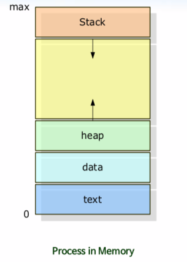

  * **Stack** : 지역 변수
  * **Stack bottom, heap top (빈공간)** : 스택과 힙이 아직 사용하지 않은 부분
  * **heap** : 동적 변수
  * **data** : 전역 변수
  * **text** : 코드

## 프로세스 상태

* **프로세스는 실행되면서 상태가 변한다.**

   대부분의 프로세스들은 준비 또는 대기 상태이며 어느 한 순간의 **한 처리기상에서는 오직 하나의 프로세스만이** 실행. 

  **ex)** CPU 가 1개 일때 (싱글 프로세싱)

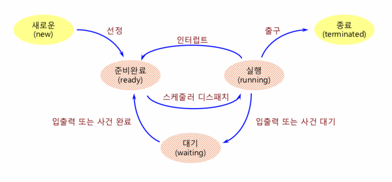

> 1. **새로운(new)** : 새로운 프로세스를 가져온다.
> 2. **준비완료(ready)** : 현재 실행 중인 프로세스가 종료되서 준비완료 상태인 프로세스를 스케줄링의 디스패치(dispatch)되길 기다린다.
> 3. **실행(running)** : 프로세스를 CPU에서 실행시킨다.
>

**인터럽트(interrupt)** : 프로세스를 중단시킨 뒤, 준비완료 상태로 보낸다.
**대기(waiting)** : 입출력 후 대기 상태가 된다.
**종료(terminated)** : 실행이 완료되면 종료 상태로 프로세스를 끝낸다.

## 프로세스 제어 블록(1)

* **프로세스 제어 블록 (Process Control Block: PCB)**

  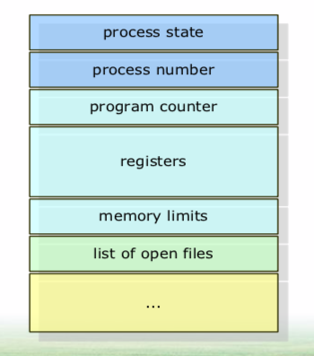

  > **process state** : 프로세스 상태, 생성(create), 준비(ready), 실행(running), 대기(waiting), 완료(terminated) 
  >
  > **process number** : PID, 프로세스 식별자
  >
  > **program counter** : 이 프로세스가 다음에 실행할 명령어의 주소를 가진다.
  >
  > **registers** : CPU 레지스터
  >
  > **memory limits** : 메모리 관리 정보

  

## 프로세스 제어 블록(2)

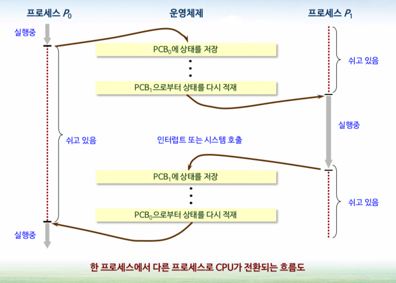

> 1. 프로세스 P0, **running** (CPU에서 실행중)
> 2. 프로세스 P0, **waiting** (입출력) PCB0 에 상태 저장
> 3. PCB1 상태 다시 적재, 프로세스 P1 **running**
> 4. 프로세스 P1, **waiting** (입출력) PCB1 에 상태 저장

# 02. Process Scheduling (프로세스 스케줄링)

## 스케줄링 큐(1)

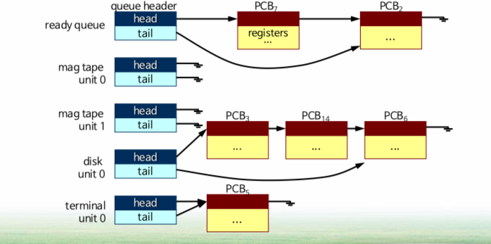

* **ready queue(준비 완료 큐)** : 메인 메모리에 존재하며, 준비 완료 상태에서 실행을 대기하는 프로세스들로 구성

## 스케줄링 큐(2)

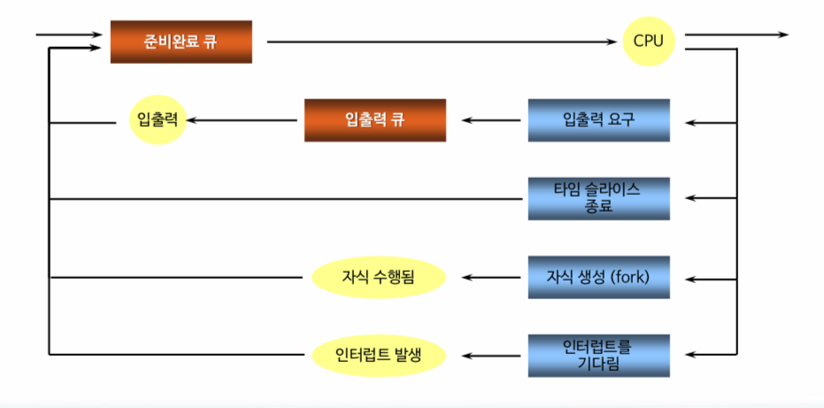

> 1. **new** : 새로운 프로세스가 준비 완료 큐로 들어온다.
> 2. **running** : 프로세스를 CPU 에서 연산을 한다.
> 3. **waiting** : 프로세스가 입출력 큐에 있다가 입출력 수행
> 4. **terminated(종료)** : 프로세스가 종료됨
>
> **타임 슬라이스 종료** : 시분할 시스템 원리

## 스케줄러(1)

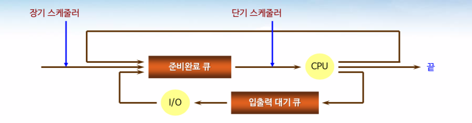

> 1. 프로세스가 **장기 스케줄러로** 인해 선택되어 메모리에 올라온다.
> 2. 프로세스가 **준비 완료 큐** 에서 대기한다
> 3. **단기 스케줄러** 가 process를 ready queue 에서 CPU로 배정한다.

* **장기 스케줄러**
  * 프로세스들을 선택하여 실행하기 위해 **메모리로 적재한다.**
* **단기 스케줄러**
  * 실행 준비가 되어 있는 프로세스들 중에서 하나를 선택하여 **CPU를 할당한다.**

* **실행 빈도수** : 장기 <<  단기

## 스케줄러(2)

* **장기 스케줄러는 신중한 선택을 하는 것이 중요하다.**
  * 입출력 중심 프로세스 (I/O-bound process)
  * CPU 중심 프로세스 (CPU-bound process)
  * **위의 두 개의 프로세스를 적절한 비율로 섞는 것이 중요하다!! **

* **시분할 시스템과 같은 일부 운영체제들은 중간 수준의 스케줄링 도입 => 중기 스케줄러**

  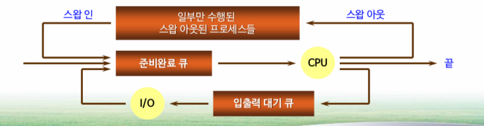

  > 스왑 아웃 부분이 메모리에 있는 process를 잠시 빼놓는 역할을 한다. **(중기 스케줄러)**

  * 메모리에서 경쟁하는 프로세스들의 수를 줄여서 다중 프로그래밍 차수를 완화하기 위함.

## 문맥 교환

* **문맥(context)은 프로세스의 PCB에 표현된다.**

  * 문맥(context) : 현재 올라와 있는 프로세스 정보들
  * CPU 레지스터 값, 프로세스 상태, 메모리 관리 정보 등

* **문맥 교환(context switch)**

  * CPU를 다른 프로세스로 교환하기 위해 이전의 **프로세스의 상태를 저장하고 새로운 프로세스의 저장된 상태를 복구** 하는 작업.

  * 문맥 교환 시간은 하드웨어에 의해 좌우된다.(특수명령어: 문맥 교환을 한번에 실행시키는 명령어)
  * 문맥 교환 시간은 순수한 오버헤드이다. (CPU 입장에서 문맥교환을 할 때 시간이 낭비된다.)

# 03. Operation on Processes (프로세스에 대한 연산)

## 프로세스 생성(1)

 프로세스는 **실행되는 동안 여러 개의 새로운 프로세스들을 생성** 할 수 있다.

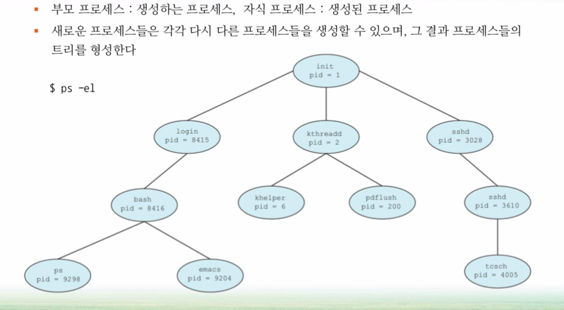

> 1. Init 이라는 프로세스가 **임의로 부모 프로세스로 정해진다.**
> 2. 부모 프로세스가 **자식 프로세스를 생성한다.**
>
> **Ex)** Windows(부모 process) - PDF(자식 process)

## 프로세스 생성(2)

* 자식 프로세스는 생성될 때 **자원이 필요하다.**
  * 자원을 **운영체제로부터** 직접 얻거나,
  * **부모 프로세스가** 가진 자원의 부분 집합 만을 사용
* 두 프로세스를 **실행하는** 두 가지 가능한 방법
  * 부모 프로세스는 계속 자식 프로세스와 **병행하게 실행** 한다.
  * 부모 프로세스는 자식 프로세스들이 **끝날 때까지 기다린다.**
* 프로세스들의 **주소 공간** 측면에서 두 가지 가능성
  * 자식 프로세스는 부모 프로세스의 **복사본이다.** (부모와 같은 일을 한다)
  * 자식 프로세스가 자신에게 적재될 **새로운 프로그램을** 가진다. (자식이 새로운 일을 한다.)

## 프로세스 생성(3)

* **Unix 운영체제 프로세스 생성(시스템 호출)**
  * fork : 새로운 프로세스 생성
  * exec : 새로운 프로그램으로 대치
  * wait : 자식이 종료될 때까지 대기

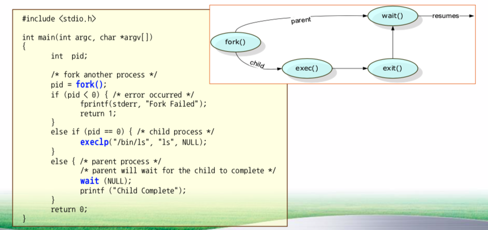

> 1. **fork()** : New Process (부모 process 복사본)
> 2. **if (pid < 0)** : 프로세스 과부화로 인해 error 발생시
> 3. **execlp()** : 자식 process 에게 역할 부여 (자식 process pid == 0)
> 4. **exit()** : 실행결과를 부모 process 에게 알림
> 5. **wait()** : 부모 process를 멈추게 함

## 프로세스 생성(5)

* **CreateProcess** : 자식 process 생성
* **WaitForSingleObject** : 부모 process 가 대기한다. (자식이 끝날때 까지)

## 프로세스 종료

* 프로세스는 **exit 시스템 호출을** 사용하여 운영 체제에 자신의 삭제를 요청하면 종료된다.
  * 자신의 부모 프로세스에게 상태 값을 반환할 수 있다.(wait)
  * 모든 자원은 운영 체제로 반납
* 프로세스는 다른 프로세스의 **종료를 유발할(kill)** 수 있다.
* **연속적 종료 (cascading termination)** : 부모 process가 종료되면 모든 자식 process 가 종료된다.

# 04. Interprocess Communication (프로세스 간 통신)

## 협력적인 프로세스(1)

* **독립적인 프로세스들**
  * 다른 프로세스들에게 영향을 주지 않는다.
  * 다른 프로세스와 **데이터를 공유하지 않는** 프로세스
* **협력적인 프로세스들**
  * 다른 프로세스들에게 영향을 주거나 받는 프로세스
  * 다른 프로세스들과 자료를 공유하는 프로세스(프로세스 끼리 협업, **데이터를 공유** )
* **프로세스 협력을 허용하는 환경을 제공하는 이유**
  * 정보 공유 (Information sharing) : 정보를 병행적으로 접근함.
  * 계산 가속화 (Computation speed-up) : 각각 다른 서브 태스크들과 병렬로 실행
  * 모듈성 (Modularity) : 모듈 형태로 시스템 구성
  * 편의성 (Convenience) : 작업할 많은 태스크를 가질 수 있다.

## 협력적인 프로세스(2)

 협력적 프로세스들은 **자료와 정보를 교환할 수 있는 기법을 필요로 한다.**

* **IPC(Interprocess communication) 기법**

  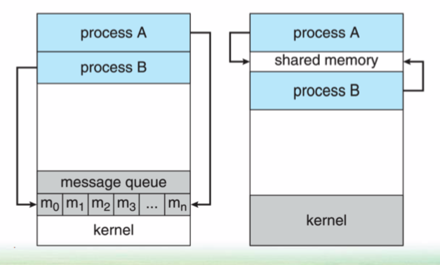

  * 메시지 전달 시스템 (message-passing system)
  * 공유 메모리 시스템 (shared memory system)

## 공유 메모리 시스템(1)

* 통신하는 프로세스들이 **공유 메모리 영역을 구축** 해야 한다.
  * **공유 메모리(세그먼트)** 를 생성하는 프로세스의 주소 공간에 위치
  * 다른 프로세스가 통신할려면 이 **세그먼트를 자신의 주소 공간에 추가** 하여야 한다.
* **생산자-소비자 프로세스 예**
  * 생산자(데이터 생산) => 소비자(데이터 소비)
  * **무한** 버퍼 (unbounded buffer)의 생산자 - 소비자 문제 : 배열이 무한
  * **유한** 버퍼 (bounded buffer)의 생산자 - 소비자 문제 : 배열이 유한

## 공유 메모리 시스템(2)

* **생산자 프로세스**

  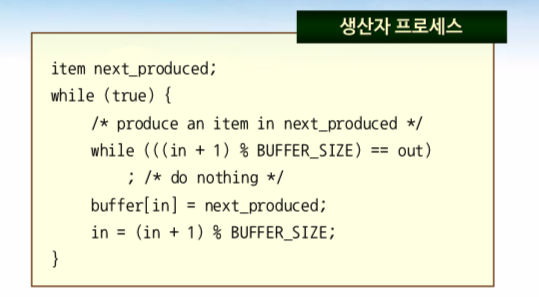

  > 1. 공간 확인
  > 2. 버퍼 채움(데이터 생산)

  

* **소비자 프로세스**

  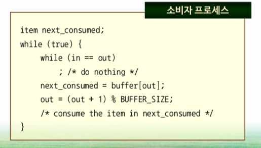

  > 1. 존재하는지 확인
  > 2. 버퍼 사용(데이터 소비)

## 메시지 전달 시스템

 **운영체제가 메시지 전달 설비를 통하여** 서로 협력하는 프로세스 간 통신 수단을 제공한다.

* **메시지 전달 시스템**
  * 두 가지 연산 제공
    * send(message)
    * receive(message)

## 메시지 전달 시스템 - 명명

* **직접 통신**
  * 통신의 수신자 또는 송신자의 이름을 명시해야 한다. 
  * **ex) send(P, message), receive(Q, message)**
  * 두 프로세스 사이에만 명시적으로 지정됨. 즉, 두 개의 프로세스만 통신 가능
* **간접 통신**
  * 메시지들은 메일 박스(ports)로 송신되고 그것으로부터 수신된다.
  * **ex) send(A, message), receive(A, message)**
  * 두 개 이상의 프로세스와 연관될 수 있음. 즉, 여러 개의 프로세스가 통신 가능

## 메시지 전달 시스템 - 버퍼링

**메시지 큐** : 통신하는 프로세스들에 의해 교환되는 메시지는 임시 큐에 존재한다.

* **무용량**(zero capacity)
  * 큐의 길이가 0인 경우
  * 1:1 메시지 통신
* **유한 용량**(bounded capacity)
  * 큐의 길이가 n > 0 인 경우
  * 송신자는 큐가 꽉 찼는지 확인 해야한다.
* **무한 용량**(unbounded capacity)
  * 큐의 길이가 무한
  * 송신자가 계속 큐에 메시지를 넣는다.

> **유용량(nonzero capacity)** 의 경우, 송신자의 입장에서 수신자의 **메시지의 도달이 잘 되었는지** 확인되지 않는다. 수신을 확인하기 위해서는 명시적인 통신 필요.

# Communication in Client-Server Systems      (클라이언트-서버 환경에서 통신)

* **세 가지 통신 전략**
  * 소켓 (Sockets)
  * 원격 프로시저 호출 (Remote Procedure Calls; RPC)

## 소켓(1)

* **소켓(socket)** : 통신의 극점

  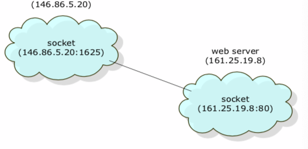

  * 두 프로세스가 통신하려면 프로세스마다 하나씩, **두 개의 소켓 필요**
  * 각 소켓은 IP 주소와 포트 번호 두 가지를 접합해서 식별된다.
    * **IP 주소** : 컴퓨터를 식별
    * **포트 번호** : 프로그램을 식별

## 원격 프로시저 호출

* **Remote Procedure Call(원격 프로시저 호출)**
  * 클라이언트가 자기의 프로시저를 호출하는 것 처럼 **원격 호스트의 프로시저를 호출하여 사용.**

