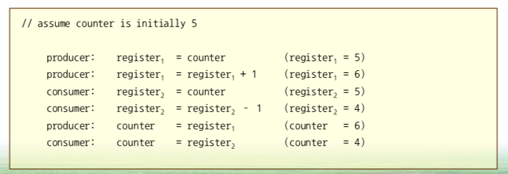

# Process Synchronization (프로세스 동기화)

임계 구역 문제와 소프트웨어 및 하드웨어 해결책

* 배경 (Background)
* 임계 구역 문제 (Critical Section Probelm)
* 피터슨의 해결안 (Peterson's Solution)
* 동기화 하드웨어 (Synchronization Hardware)
* 뮤텍스 락 (Mutex Locks)
* 세마포 (Semaphores)
* 고전적인 동기화 문제들 (Classic Problems of Synchronization)
* 모니터 (Monitors)
* 교착 상태 (Deadlocks)


# 01. Background (배경)

협력적인 순차적 프로세스 모델

* 프로세스들은 서로 **비동기적으로** 수행하면서 **데이터를 공유할 수 있다.**


##유한 버퍼 문제 (1)


* 원형 큐 배열로 버퍼가 저장되는데 원형 큐 배열은 **최대 BUFFER_SIZE - 1 까지만 저장할 수 있는 유한 버퍼 문제** 가 있다.


## 유한 버퍼 문제 (2)


* 유한 버퍼 문제 (1)을 해결하기 위해 counter 변수를 추가함.
* 하지만 생산자와 소비자 프로세스를 병렬적으로 수행한다면 **counter 변수에 문제가 발생한다.**


## 경쟁 상황 (1)

* counter 변수에 의한 **경쟁 상황 발생**

  : 두 개의 프로세스가 counter 변수를 동시에 조작

  


## 경쟁 상황 (2)

* **경쟁 상황 (race condition)**

  * 동시에 여러 개의 프로세스가 동일한 자료를 접근하여 조작하고, 그 실행 결과가 접근이 발생한 특별한 순서에 의존하는 것.

  * 다음 문장들이 **atomic (원자)** 하게 수행되어야 함.

    ```c
    counter++;
    counter--;
    ```

  * Atomic operation ?

    : 원자와 같이 끼어들 수 없는 연산

> 프로세스의 동기화와 조정 필요.


# 02. Critical Section Problem (임계 구역 문제)

**임계 구역 (critical section)**

* 다른 프로세스와 **공유하는 변수를 변경하거나,** 테이블을 갱신하거나 파일을 쓰거나 하는 등의 작업을 수행한다.
* 임계 구역의 실행은 시간적으로 **상호 배타적**
  * 한 프로세스가 임계 구역에서 수행하는 동안에는 다른 프로세스들은 임계 구역에서 실행되지 않도록 한다.


**임계 구역 문제는 프로세스들이 협력할 때 사용할 수 있는 프로토콜을 설계 하는 것이다.**

* **진입 구역 (entry section)**
  * 자신의 임계 구역으로 진입하려면 **진입 허가를 요청해야 한다.**
* **나머지 구역 (remainder section)**
  * 코드의 나머지 부분


## 임계 구역 문제 해결안

* **상호 배제 (mutual exclusion)**

  : 한 프로세스가 임계 구역에서 실행된다면 다른 프로세스들은 임계 구역에서 실행될 수 없다.

* **진행 (progress)**

  : 자기의 임계 구역에서 실행되는 프로세스가 없고, 그들 자신의 임계 구역으로 진입하려고 하는 프로세스들이 있다면, 나머지 구역에서 실행 중이지 않은 프로세스들만 다음에 임계 구역에 진입할 프로세스를 결정하는 데 참여할 수 있으며, 이 선택은 무한하게 연기될 수 없다.

* **한계 대기 (bounded waiting)**

  * 프로세스가 자기의 임계 구역에 진입하려는 요청을 한 후부터 그 요청이 허용될 때 까지 다른 프로세스들이 임계 구역에 진입하도록 허용하는 횟수에 한계가 있어야 한다.


## 운영체제 내에서의 임계 구역

* 운영체제 내에서 임계 구역을 다루기 위해 **선점형 커널과 비선점형 커널의** 두 가지 일반적인 접근법이 사용된다.
  * **비선점형 커널**
    * 커널 모드에서 수행되는 프로세스의 **선점을 허용하지 않는다.**
    * 자발적으로 CPU의 제어를 양보할 때까지 계속 수행된다.
    * 경쟁 조건을 염려할 필요가 없다.
  * **선점형 커널**
    * 프로세스가 커널 모드에서 수행되는 동안 **선점되는 것을 허용한다.**
    * 실시간 프로그래밍에 적당하다.
    * 경쟁 조건을 염려하고 설계해야 한다.


# 03. Peterson's Solution (피터슨의 해결안)

각 프로세스에 P0, P1 으로 번호 부여한다.


## 알고리즘 1

**공동 변수 turn 사용.**


* 상호 배제 조건을 충족한다.

* **진행 요건을 충족하지 못한다.**

  : turn이 0이고 P0가 나머지 구역에 있으면 P1이 임계 구역에 들어갈 준비가 되어 있어도 임계 구역으로 들어갈 수 없다. **즉, P1은 P0가 실행되기 전에 실행되지 않는 문제점이 있다.**

* 프로세스 상태에 관한 정보를 충분히 유지하지 못하고 있다.


## 알고리즘 2

**배열 flag 사용**


* **flag[2]** : 임계 구역으로의 진입 여부를 확인하는 상태. 프로세스가 각자 하나씩 갖고 있는다.
* 상호 배제 조건을 충족한다.
* **진행 조건을 충족되지 않는다.**
  * 두 프로세스가 동시에 시작되면 flag 값이 둘다 true 이기 때문에 진입 구역에서 무한 반복하게 된다.


## Peterson's solution (피터슨의 해결안)

**알고리즘 1과 2의 개념을 결합**


* **3가지 요건 모두 충족**
  * 상호 배제
    * 두 프로세스가 동시에 실행된다 해도 flag는 둘다 true 이지만 turn 이 1이거나 0 이기 때문에 한 프로세스는 임계 구역으로 들어갈 수 있게 된다.
  * 진행 조건
    * P0가 요청했을 때 이미 P1이 임계 구역을 수행 중이면, flag[1] = true 이고 turn = 1 이므로 P0는 기다리다가, P1가 임계 구역을 벗어나는 순간 flag[1] = false 가 되어 P0 가 임계 구역에 진입하게 된다.
  * 한계 대기
    * P0는 P1이 기껏해야 한번 임계 구역에 들어간 후에는, P1이 나머지 구역을 수행 중이라도 임계 구역에 들어갈 수 있다.