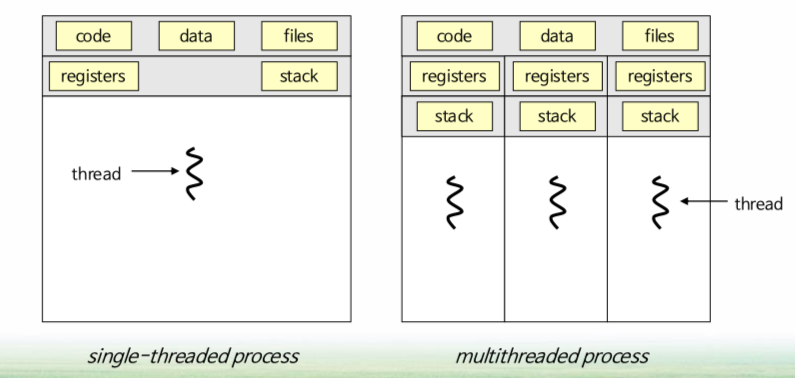

# Thread (스레드)

* CPU 이용의 기본 단위인 스레드를 소개한다.
  * 개요 (Overview)
  * 다중 코어 프로그래밍 (Multicore Programming)
  * 다중 스레드 모델 (Multithreading Models)
  * 암묵적 스레딩 (Implicit Threading)
  * 스레드와 관련된 문제들 (Threading Issues)

# 01. 개요

* **Thread = CPU 이용의 기본 단위**

  * 구성 : 스레드 ID, PC(프로그램 카운터), 레지스터, 스택

  

## 동기(1)

* **모든 소프트웨어 응용들은 다중 스레드를 이용한다.**
  * 몇 개의 실행 흐름을 가진 독립적인 프로세스로 구현된다.

## 동기(2)

* 하나의 응용이 