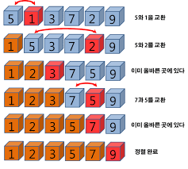
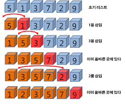
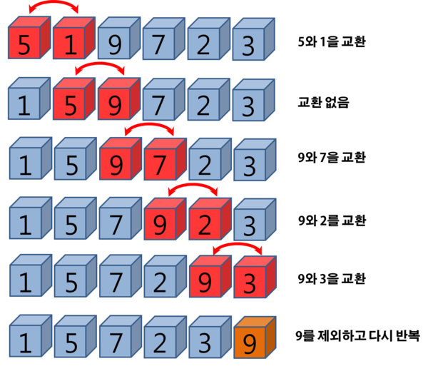
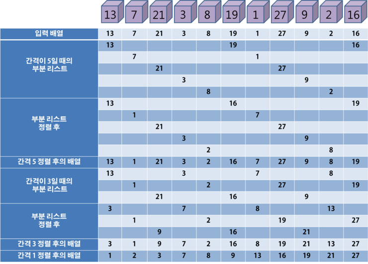
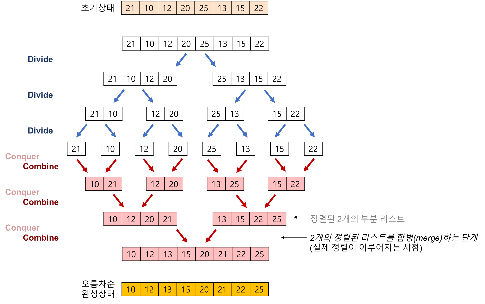
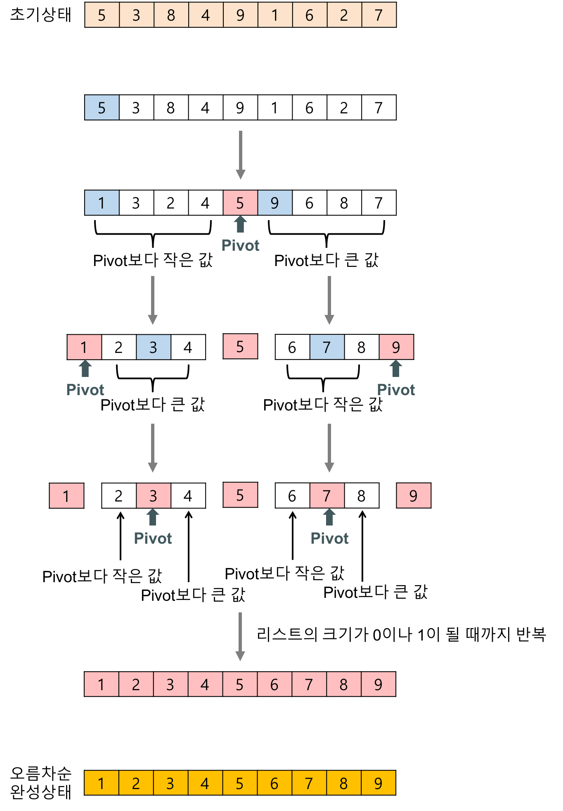
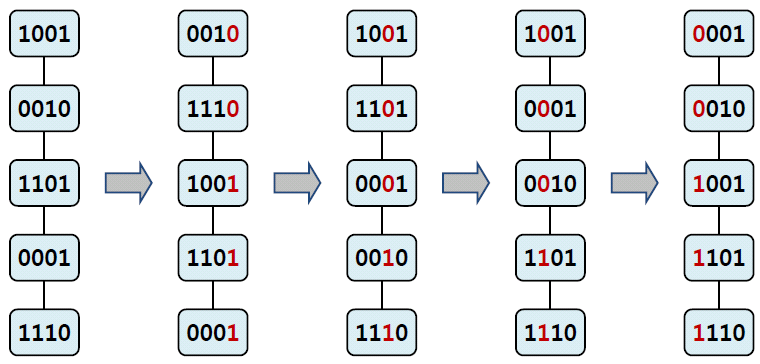

# Chapter 13. 정렬

# 13.1. 정렬이란?

**정렬(sorting)** 은 크기순으로 **오름차순(ascending order)** 이나 **내림차순(descending order)** 으로 나열하는 것.

* **레코드(record)** : 정렬시켜야 될 대상 (ex. 학생)
  * **필드(field)** : 레코드보다 더 작은 단위. (ex. 이름, 학번)						


# 13.2. 선택 정렬

**선택 정렬(selection sort)** : 가장 작은 숫자를 선택하여 앞으로 이동시키는 정렬 방법



* **코드**

```java
public int[] sort(int[] list) {
  int[] sorted = list.clone();

  for (int i = 0; i < list.length - 1; i++) {
    int least = i;

    // 최소값 탐색
    for (int j = i + 1; j < list.length; j++) {
      if (sorted[j] < sorted[least]) least = j;
    }

    // 최소값 위치랑 i 위치랑 값 교체
    int temp = sorted[i];
    sorted[i] = sorted[least];
    sorted[least] = temp;
  }

  return sorted;
}
```

* **선택 정렬의 분석**

  (n - 1) + (n - 2) + … + 1 = n(n - 1) / 2 = O(n^2)


# 13.3. 삽입 정렬

**삽입 정렬(insertion sort)** : 정렬되어 있지 않은 리스트의 첫 번째 숫자가 정렬된 리스트의 어느 위치에 삽입되어야 하는가를 판단한 후 해당 위치에 숫자 삽입을 반복하는 정렬.



* **코드**

```java
public int[] sort(int[] list) {
  int[] sorted = list.clone();
  int j;

  for (int i = 1; i < list.length; i++) {
    int key = sorted[i];
    for (j = i - 1; j >= 0 && sorted[j] > key; j--)
      sorted[j + 1] = sorted[j];
    sorted[j + 1] = key;
  }

  return sorted;
}
```

* **삽입 정렬의 분석**

  n(n - 1) / 2 = O(n^2)


# 13.4. 버블 정렬

**버블 정렬(bubble sort)** : 인접한 2개의 레코드를 비교하여 크기가 순서대로 되어 있지 않으면 서로 교환하며 비교-교환 과정을 반복하여 정렬하는 방법이다.



* **코드**

```java
public static int[] sort(int[] list) {
  int[] sorted = list.clone();

  for (int i = list.length - 1; i > 0; i--)
    for (int j = 0; j < i; j++)
      if (sorted[j] > sorted[j + 1]) {
        int temp = sorted[j];
        sorted[j] = sorted[j + 1];
        sorted[j + 1] = temp;
      }

  return sorted;
}
```

* **버블 정렬의 분석**

  n(n - 1) / 2 = O(n^2)


# 13.5. 셸 정렬

**셸 정렬(shell sort)** : 삽입 정렬이 어느 정도 정렬된 배열에 대해서는 대단히 빠른 것에 착안한 방법이다. 정렬해야 할 리스트를 일정한 기준에 따라 분류하여 연속적이지 않은 여러 개의 부분 리스트를 만들고 각 부분 리스트를 삽입 정렬을 이용하여 정렬한다.



* **코드**

```java
public static int[] insertSort(int[] list, int first, int last, int gap) {
  int[] sorted = list.clone();
  int j;
  // gap 만큼 떨어진 요소들을 삽입 정렬
  // 정렬 범위는 first 에서 last
  for (int i = first + gap; i <= last; i += gap) {
    int key = sorted[i];
    for (j = i - gap; j >= first && key < sorted[j]; j -= gap)
      sorted[j + gap] = sorted[j];
    sorted[j + gap] = key;
  }

  return sorted;
}

private static int[] sort(int[] list) {
  int[] sorted = list.clone();

  for (int gap = list.length / 2; gap > 0; gap = gap / 2) {
    if (gap % 2 == 0) gap++;
    for (int i = 0; i < gap; i++) {		// 부분 리스트의 개수는 gap
      sorted = insertSort(sorted, i, sorted.length - 1, gap);
    }
  }

  return sorted;
}
```


# 13.6. 합병 정렬

**합병 정렬(merge sort)** : 하나의 리스트를 두 개의 균등한 크기로 분할하고 분할된 부분 리스트를 정렬한 다음, 두 개의 정렬된 부분 리스트를 합하여 전체가 정렬된 리스트가 되게 하는 방법. 이 정렬은 **분할 정복 방법을** 연속하여 적용.

* **분할 정복 방법**
  1. 분할(Divide) : 입력 배열을 같은 크기의 2개의 부분 배열로 분할
  2. 정복(Conquer) : 부분 배열을 정렬.
  3. 결합(Combine) : 정렬된 부분 배열들을 하나의 배열에 합병



* **코드**

```java
private static int[] merge(int[] list, int left, int mid, int right) {
  int[] sorted = list.clone();

  // i는 정렬된 왼쪽 리스트에 대한 인덱스
  // j는 정렬된 오른쪽 리스트에 대한 인덱스
  // k는 정렬될 리스트에 대한 인덱스
  int i = left, j = mid + 1, k = left;

  // 분할 정렬된 list의 합병
  while (i <= mid && j <= right) {
    if (list[i] <= list[j]) sorted[k++] = list[i++];
    else sorted[k++] = list[j++];
  }

  if (i > mid)	// 남아 있는 레코드의 일괄 복사
    for (int l = j; l <= right; l++)
      sorted[k++] = sorted[l];
  else					// 남아 있는 레코드의 일괄 복사
    for (int l = i; l <= mid; l++)
      sorted[k++] = list[l];

  return sorted;
}

public static int[] sort(int[] list, int left, int right) {
  int[] sorted = list.clone();

  int mid;
  if (left < right) {
    mid = (left + right) / 2;										// 리스트의 균등 분할
    sorted = sort(sorted, left, mid);						// 부분 리스트 정렬
    sorted = sort(sorted, mid + 1, right);			// 부분 리스트 정렬
    sorted = merge(sorted, left, mid, right);		// 합병
  }

  return sorted;
}
```

* **합병 정렬의 분석**

  일반적으로 레코드의 개수가 n = 2^k 이라고 하면 순환 호출의 깊이가 k가 될 것이다. 그러므로 k = log(2)n 임을 알 수 있다. 그리고 최대 n번의 비교 연산을 하게 되었을 때, 총 비교 연산은 최대 **nlog(2)n 번** 필요하다.


# 13.7. 퀵 정렬

**퀵 정렬(quick sort)** : 합병 정렬과 비슷하게 전체 리스트를 2개의 부분 리스트로 분할하고, 각각의 부분 리스트를 다시 퀵 정렬하는 전형적인 분할 정복 방법을 사용한다. 그러나 합병 정렬과는 달리 **피봇(pivot)을 사용하여** 비균등하게 리스트를 분할한다. 피봇보다 작은 요소들은 모두 피봇의 왼쪽으로 옮겨지고 피봇보다 큰 요소들은 모두 피봇의 오른쪽으로 옮겨진다. 이 상태에서 피봇을 제외한 **왼쪽과 오른쪽 리스트를 다시 정렬하게 되면** 전체 리스트가 정렬된다.



* **코드**

```java
public class QuickSort {

  int[] sorted;

  QuickSort(int[] list) {
    sorted = list;
  }

  // 정렬 메소드
  public void sort() {
    // 시작과 마지막 인덱스 입력
    recursiveSort(0, sorted.length - 1);
  }

  // partition 메소드를 통해 분할할 위치를 구한다.
  public void recursiveSort(int left, int right) {
    if (left < right) {
      int q = partition(left, right);
      // 분할 위치 기준으로 왼쪽 리스트와 오른쪽 리스트 다시 정렬
      recursiveSort(left, q - 1);
      recursiveSort(q + 1, right);
    }
  }

  // 분할 및 정렬을 위한 메소드
  private int partition(int left, int right) {
    int pivot = sorted[left], temp;
    int low = left, high = right + 1;

    // low와 high가 역전하기 전까지
    do {
      do {
        low++;
      } while (low <= right && sorted[low] < pivot);
      do {
        high--;
      } while (high >= left && sorted[high] > pivot);

      if (low < high) {
        temp = sorted[low];
        sorted[low] = sorted[high];
        sorted[high] = temp;
      }
    } while (low < high);

    temp = sorted[left];
    sorted[left] = sorted[high];
    sorted[high] = temp;

    return high;
  }

  public static void main(String[] args) {
    int[] list = {5, 1, 3, 7, 2, 9};

    QuickSort quickSort = new QuickSort(list);
    quickSort.sort();

    for (int i : quickSort.sorted) {
      System.out.println(i);
    }
  }

}
```

* **퀵 정렬의 분석**

  n개의 레코드를 가지는 리스트는 n/2^k 의 크기로 나누어질 것이다. 크기가 1이 될 때까지 나누어지므로 n/2^k = 1 일 때까지 나누어질 것이고, 따라서 k = log(2)n 개의 패스가 필요하게 된다. 그리고 평균 n번 정도의 비교가 이루어지므로 퀵정렬의 시간 복잡도는 **O(nlog(2)n)** 이 된다.


# 13.8. 기수 정렬

**기수 정렬(radix sort)** : 레코드를 비교하지 않고도 정렬할 수 있는 방법이다. 각 자릿수가 0에서 9까지의 값만 있으므로, 이것에 착안하여 10개의 <u>버켓(bucket)</u> 을 만들어서 입력 데이터를 각 자릿수의 값에 따라 버켓에 넣는다.



* **코드**

```java
package chapter14_sorting;

import java.util.LinkedList;
import java.util.Queue;

public class RadixSort {

  private final int BUCKETS = 10;								// 0~9 기수를 나타내기 위함
  private final int DIGITS = 2;									// 두자리 수를 뜻함
  private Queue[] queues = new Queue[BUCKETS];	// 자리수 마다 정렬을 하기 위함

  RadixSort() {
    for (int i = 0; i < queues.length; i++) {
      queues[i] = new LinkedList<Integer>();		// 값을 넣을 큐 배열 객체 저장
    }
  }

  public int[] sort(int[] list) {
    int[] sorted = list.clone();
    int factor = 1;

    for (int i = 0; i < DIGITS; i++) {
      for (int j = 0; j < list.length; j++)
        queues[(sorted[j] / factor) % 10].add(sorted[j]);		// 한자리씩 비교하여 큐에 삽입

      for (int k = 0, l = 0; k < BUCKETS; k++) {
        while (!queues[k].isEmpty()) {
          sorted[l++] = (int) queues[k].poll();							// 큐 순서대로 배열에 정렬
        }
      }

      factor *= 10;		// 자리수 올림
    }

    return sorted;
  }

  public static void main(String[] args) {
    int[] list = {51, 12, 33, 74, 26, 95};

    RadixSort radixSort = new RadixSort();

    int[] sorted = radixSort.sort(list);

    for (int i : sorted) {
      System.out.println(i);
    }
  }

}
```

* **기수 정렬의 분석**

  리스트가 n개의 정수를 가지고 있고 d개의 자리수라 할때, **O(d x n)** 시간 복잡도를 가진다.